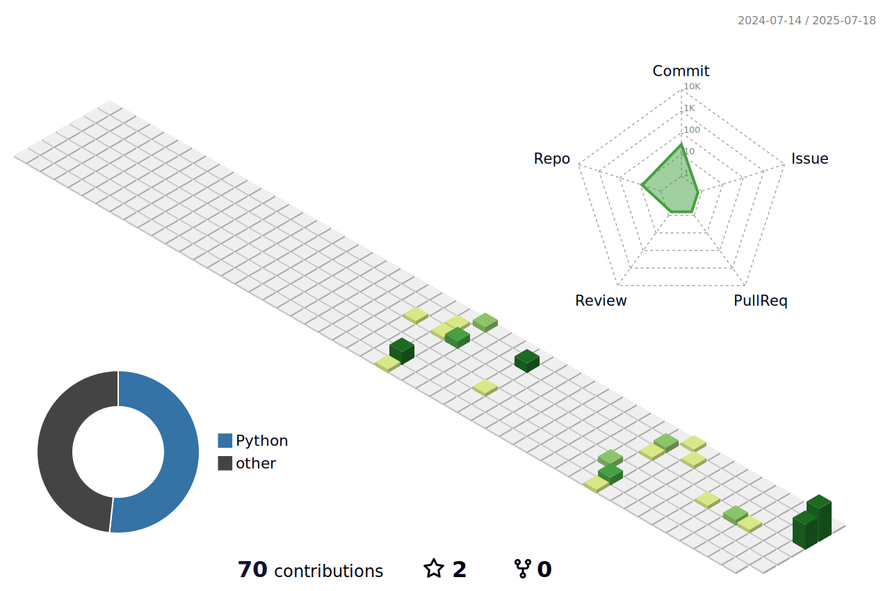

<h1 align="center">
    
</h1>

<h3 align="center">A persistent learner always intrigued by new technologies</h3>
<h3 align="center">Data Science + Systems | Applied AI | Health & Risk Modeling</h3>

 

 
 🔭 I’m currently working on **expanding my skillset**  
 🌱 I’m currently learning **Docker, PostgreSQL**

 

### 🧠 Currently Building
- 🚑 **Federated Health Risk System** – Privacy-first modeling of global health threats using federated learning  
- 🕸️ **Graph AML Engine** – GNN-based anti-money laundering graph system for fraud detection

### 🚀 Exploring
`FastAPI` • `PostgreSQL` • `Docker` • `Graph Learning` • `System Design`

---

 

---

<h2 align="center">⚒️ Tech Stack & Tools</h2>
 

    

---

  <h2>🧊 GitHub 3D Contributions</h2>
   
  
  <!-- You can switch this to any of these:
       profile-green-animate.svg
       profile-season-animate.svg
       profile-night-view.svg
       profile-night-rainbow.svg -->

---
---

<h2 align="center">📌 Featured Projects</h2>

  
  

  
  

---

<h2 align="center">⚡ GitHub Stats</h2>

  
  
    
  

---

<h3 align="center">
    
</h3>
