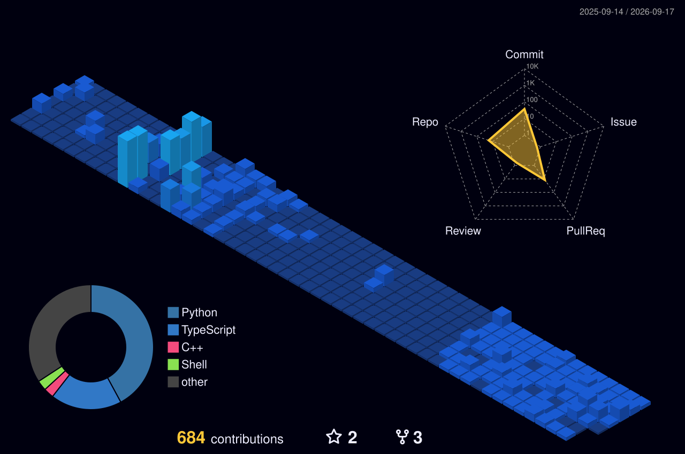

<div align="center">
  <picture>
    <source media="(prefers-color-scheme: dark)" srcset="assets/hero-dark.svg" />
    <source media="(prefers-color-scheme: light)" srcset="assets/hero-light.svg" />
    
  </picture>
</div>

<div align="center">
  <a href="mailto:ishaan272002@gmail.com">
    
  </a>
  <a href="https://www.linkedin.com/in/ishaan-potle-15b0741ba/">
    
  </a>
  <a href="https://ishaanpotle.github.io/">
    
  </a>
  <a href="https://leetcode.com/IshaanPotle/">
    
  </a>
</div>


## About

```yaml
name:      Ishaan Potle
role:      M.S. Data Science @ Stony Brook University
focus:     [ Applied AI, Health & Risk Modeling, Graph Learning ]
exploring: [ Graph Neural Networks, Distributed Systems, System Design ]
open_to:   [ Research collabs, OSS contributions, Full-time roles ]
```


## Tech Stack

<table align="center">
  <tr>
    <td align="center" width="330"><sub><b>LANGUAGES</b></sub><br/><br/>
      
    </td>
    <td align="center" width="330"><sub><b>ML &amp; DATA</b></sub><br/><br/>
      
    </td>
  </tr>
  <tr>
    <td align="center" width="330"><sub><b>FRAMEWORKS</b></sub><br/><br/>
      
    </td>
    <td align="center" width="330"><sub><b>DATA INFRA</b></sub><br/><br/>
      
    </td>
  </tr>
  <tr>
    <td align="center" width="330"><sub><b>CLOUD &amp; DEVOPS</b></sub><br/><br/>
      
    </td>
    <td align="center" width="330"><sub><b>TOOLING</b></sub><br/><br/>
      
    </td>
  </tr>
</table>


## Featured Projects

<table>
  <tr>
    <td width="50%" valign="top">
      <h3><a href="https://github.com/IshaanPotle/Federated-Health-Risk-Prediction-System">Federated Health Risk Prediction</a></h3>
      <p>Privacy-preserving federated learning pipeline for clinical risk scoring — trains across sites without centralising patient data.</p>
      <p>
        
        
        
      </p>
    </td>
    <td width="50%" valign="top">
      <h3><a href="https://github.com/IshaanPotle/Graph-Neural-Network-AML-Detection-Engine">GNN AML Detection Engine</a></h3>
      <p>Graph neural network that flags money-laundering rings by learning over transaction graphs instead of isolated rows.</p>
      <p>
        
        
        
      </p>
    </td>
  </tr>
  <tr>
    <td width="50%" valign="top">
      <h3><a href="https://github.com/IshaanPotle/LLM_Medical-Chatbot">LLM Medical Chatbot</a></h3>
      <p>Retrieval-augmented clinical assistant with grounded citations and guardrails against unsupported medical claims.</p>
      <p>
        
        
        
      </p>
    </td>
    <td width="50%" valign="top">
      <h3><a href="https://github.com/IshaanPotle/Bias-Resistant-Resume-Ranker">Bias-Resistant Resume Ranker</a></h3>
      <p>Fairness-aware ranking system that audits and mitigates demographic bias in automated candidate screening.</p>
      <p>
        
        
        
      </p>
    </td>
  </tr>
  <tr>
    <td width="50%" valign="top">
      <h3><a href="https://github.com/IshaanPotle/Global-Food-Supply-Chain-Resilience-Analyzer">Food Supply Chain Resilience</a></h3>
      <p>Network analysis of global food trade to quantify shock propagation and surface fragile supply routes.</p>
      <p>
        
        
        
      </p>
    </td>
    <td width="50%" valign="top">
      <h3><a href="https://github.com/IshaanPotle/Data-Science-Sandbox">Data Science Sandbox</a></h3>
      <p>Running notebook lab — modelling ideas, benchmarks and write-ups that later graduate into full projects.</p>
      <p>
        
        
        
      </p>
    </td>
  </tr>
</table>


## Stats

<div align="center">
  <picture>
    <source media="(prefers-color-scheme: dark)" srcset="assets/generated/stats-dark.svg" />
    <source media="(prefers-color-scheme: light)" srcset="assets/generated/stats-light.svg" />
    
  </picture>
  <picture>
    <source media="(prefers-color-scheme: dark)" srcset="assets/generated/streak-dark.svg" />
    <source media="(prefers-color-scheme: light)" srcset="assets/generated/streak-light.svg" />
    
  </picture>
  <br/><br/>
  <picture>
    <source media="(prefers-color-scheme: dark)" srcset="assets/generated/top-langs-dark.svg" />
    <source media="(prefers-color-scheme: light)" srcset="assets/generated/top-langs-light.svg" />
    
  </picture>
</div>

<br/>

<div align="center">
  <picture>
    <source media="(prefers-color-scheme: dark)" srcset="assets/generated/snake-dark.svg" />
    <source media="(prefers-color-scheme: light)" srcset="assets/generated/snake-light.svg" />
    
  </picture>
</div>

<br/>

<div align="center">
  <picture>
    <source media="(prefers-color-scheme: dark)" srcset="profile-3d-contrib/profile-night-view.svg" />
    <source media="(prefers-color-scheme: light)" srcset="profile-3d-contrib/profile-green-animate.svg" />
    
  </picture>
</div>

<br/>

<div align="center">
  <picture>
    <source media="(prefers-color-scheme: dark)" srcset="assets/generated/leetcode-dark.svg" />
    <source media="(prefers-color-scheme: light)" srcset="assets/generated/leetcode-light.svg" />
    
  </picture>
</div>


<div align="center">
  <picture>
    <source media="(prefers-color-scheme: dark)" srcset="assets/footer-dark.svg" />
    <source media="(prefers-color-scheme: light)" srcset="assets/footer-light.svg" />
    
  </picture>
</div>
