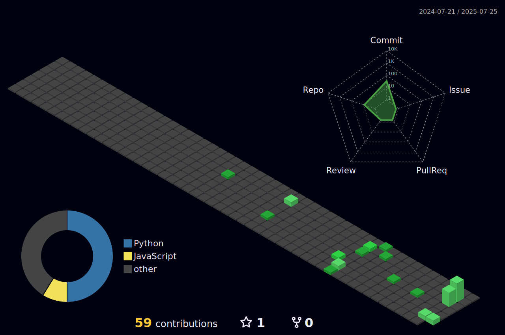

<h1 align="center">
  
</h1>

<h3 align="center">Data Science + Systems | Applied AI | Health & Risk Modeling</h3>

 

 

🎓 Currently pursuing my Master’s in Data Science at SBU  
🔭 Actively working on projects in **Applied AI**, **Health & Risk Modeling**, and **Graph Learning**  

 

### 🚀 Exploring
`Graph Learning` • `System Design`

---

 
  

  

  

  

---

<h2 align="center">⚒️ Tech Stack & Tools</h2>

<table align="center">
  <tr>
    <td align="center" width="220">
      <b>🧠 Languages</b>  
      
    </td>
    <td align="center" width="220">
      <b>⚙️ Frameworks</b>  
      
    </td>
    <td align="center" width="220">
      <b>📊 ML & Data</b>  
      
    </td>
  </tr>
  <tr>
    <td align="center" width="220">
      <b>🗄️ Data Infra</b>  
      
    </td>
    <td align="center" width="220">
      <b>☁️ Cloud & DevOps</b>  
      
    </td>
    <td align="center" width="220">
      <b>🛠️ Tools</b>  
      
    </td>
  </tr>
</table>

---

  <h2>🧊 GitHub 3D Contributions</h2>
   
  

 

  <h2>📊 LeetCode Stats</h2>
   
  

---

<h2 align="center">📌 Featured Projects</h2>

  
  
  
  
  
  

---

<h2 align="center">⚡ GitHub Stats</h2>

  
  
    
  

---

<h3 align="center">
  
</h3>
